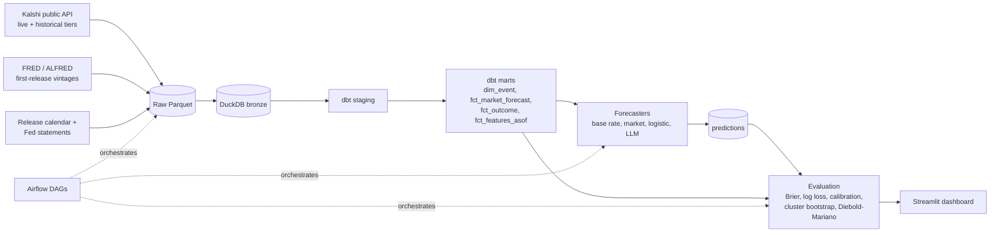

# Prediction Market Forecast Evaluation Platform

A data engineering pipeline that answers one question:

> For recurring US economic releases (CPI, jobs report, unemployment rate, Fed rate decision, GDP),
> who forecasts best: the **market price**, a **statistical model**, or an **LLM**, and is the
> difference statistically meaningful?

It ingests [Kalshi](https://kalshi.com) prediction-market data and official economic data (FRED/ALFRED,
the Fed), models it in a bronze / silver / gold DuckDB warehouse with dbt, produces probability
forecasts from four forecasters, scores them against real outcomes, and shows the results on a
Streamlit dashboard. Airflow orchestrates the daily, pre-release, post-release and weekly-quality runs.

> **Status:** the pipeline is built and tested on recorded fixtures and synthetic data, and individual
> ingestion components were checked against the live APIs (see [docs/VERIFICATION.md](docs/VERIFICATION.md)).
> **No evaluation results have been produced yet**; the Results section below holds placeholders.
> Nothing here is financial advice.

## What it does

| Forecaster | How it forecasts |
|------------|------------------|
| Market | The Kalshi YES price at forecast time (last trade, else last candle ending at or before it). |
| Base rate | Share of earlier settled contracts in the same series that resolved YES (smoothed). |
| Logistic model | Walk-forward logistic regression on as-of features (distance of the strike from the latest figure, latest change). |
| LLM | A Claude model given only as-of inputs, structured JSON output, several samples averaged, every call logged. |

Every forecast is made at one fixed `forecast_time` per event (default: 24 hours before the scheduled
release). Scores are Brier score and log loss, with calibration curves and cluster-bootstrap
confidence intervals.

## Architecture



More detail: [docs/architecture.md](docs/architecture.md), [docs/data_dictionary.md](docs/data_dictionary.md),
[docs/DECISIONS.md](docs/DECISIONS.md).

## Quickstart

Requires Python 3.11+ (3.13 also works locally), Docker only for the Airflow stack. Full setup,
environment variables and per-component commands are in [INSTRUCTIONS.md](INSTRUCTIONS.md).

```bash
python3 -m venv .venv && source .venv/bin/activate
pip install -e ".[dev,app,dbt]"
cp .env.example .env                                  # add FRED_API_KEY (free); ANTHROPIC_API_KEY is optional
python -m pmeval.ingest.fred && python -m pmeval.ingest.release_calendar && python -m pmeval.ingest.fed_statements
python -m pmeval.ingest.kalshi_historical             # resumable backfill; can take a while
python -m pmeval.warehouse.bronze && (cd dbt_project && dbt build --profiles-dir .)
python -m pmeval.forecast.run --mode backtest --forecasters base_rate,market,logreg
python -m pmeval.eval.scoring && python -m pmeval.eval.compare
streamlit run app/streamlit_app.py
```

Run the checks with `make lint` and `make test` (no network needed).

## Design decisions

- **No look-ahead.** Every input to every forecaster is timestamped at or before `forecast_time`.
  This is enforced in dbt (`fct_features_asof` plus a custom `not_after_forecast_time` test), at
  prediction time (`LeakageError`), and in the LLM forecaster (a guard that runs before any call),
  each with automated tests that fail if a future timestamp slips in.
- **As-first-released data.** Features use FRED's first-release vintages (`output_type=4`), never later
  revisions. Kalshi contracts settle on the first published number.
- **Cluster bootstrap.** Contracts of one release resolve from the same number and are not
  independent. Confidence intervals resample whole events, not contracts; a Diebold-Mariano test is
  applied to per-event differences.
- **Live before backtest.** Predictions made before a release are the primary results. Backtests are
  available immediately, but LLM backtests are labeled "possibly contaminated by training data"
  everywhere they appear.
- **Insert-only predictions.** A rerun never replaces an earlier forecast.
- **Raw is untouched.** Raw Parquet keeps the original JSON of each API record; typing happens in dbt.
- **Mocked versus live is tracked.** Unit tests never use the network; what has and has not been run
  live is recorded in [docs/VERIFICATION.md](docs/VERIFICATION.md).

## Limitations

- **Few events.** Kalshi's history for these series covers roughly 2021 to 2026 and each series has
  one release a month (GDP one a quarter), so there are on the order of 100 to 200 events in total,
  and far fewer once forecasters are compared on shared contracts. Live predictions accumulate slowly.
  Rows with fewer than 30 events are flagged; wide intervals mean "cannot tell".
- **LLM contamination.** A model trained after an event may remember its outcome. Only live
  predictions are clean. The prompt tells the model to ignore later knowledge, which cannot be
  verified.
- **API availability and terms.** Kalshi's unauthenticated API is rate limited (HTTP 429 was seen at
  five requests per second) and its historical/live split can change; FRED is limited to 120 requests
  a minute; the Fed site is scraped politely. Release times for BLS/BEA series (08:30 New York) and
  the FRED-to-Kalshi series mapping are assumptions recorded in the decisions log.
- **Approximate features.** Headline figures are rebuilt from first-release levels and can differ
  slightly from published numbers (see D12).
- **Forecast quality is not profit.** Nothing here models fees, spreads or trading, and nothing is
  financial advice.
- **Not everything has run live.** See docs/VERIFICATION.md; in particular the live LLM calls and the
  full Airflow stack with real data are unverified.

## Results

No results have been produced yet. All numbers below are placeholders to be filled from real runs
(`python -m pmeval.eval.scoring && python -m pmeval.eval.compare`, then the dashboard).

| Forecaster | Mode | Events | Contracts | Brier (95% CI) | Log loss (95% CI) |
|------------|------|--------|-----------|----------------|-------------------|
| Base rate | live | [N] | [N] | [N] ([N], [N]) | [N] ([N], [N]) |
| Market price | live | [N] | [N] | [N] ([N], [N]) | [N] ([N], [N]) |
| Logistic model | live | [N] | [N] | [N] ([N], [N]) | [N] ([N], [N]) |
| LLM | live | [N] | [N] | [N] ([N], [N]) | [N] ([N], [N]) |
| LLM | backtest (possibly contaminated) | [N] | [N] | [N] ([N], [N]) | [N] ([N], [N]) |

Pairwise differences and calibration curves: [N]. Conclusion: [to be written after real runs].

## License

MIT, see [LICENSE](LICENSE).
