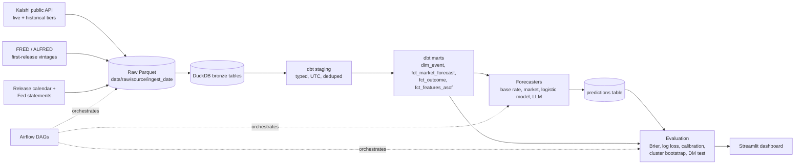

# Architecture

## Layers

| Layer | Where | Contents |
|-------|-------|----------|
| Raw | `data/raw/` (Parquet) | Untouched API responses plus `ingested_at`. Path is configurable so S3 can replace it. |
| Bronze | DuckDB | Views/tables registered over the raw Parquet. No transformation. |
| Silver | dbt `staging` | Type casting, naming, UTC timestamps, price-to-probability, dedup. |
| Gold | dbt `marts` | One row per event, market probability at forecast time, outcomes, as-of features. |
| Predictions / scores | DuckDB | Written by Python forecasters and the evaluation code. |

## No look-ahead

Every event has one `forecast_time` (default: 24 hours before the scheduled release).
Every forecaster input must be timestamped at or before it. This is enforced three ways:
a dbt generic test on the feature mart, a runtime guard in the LLM forecaster, and
pytest tests that fail when any input is newer than `forecast_time`.
